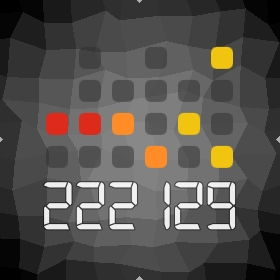
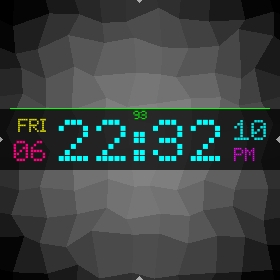
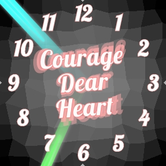

This repository tries to keep track of AsteroidOS unofficial watchfaces. Feel free
to pull request your work here and if it suits the graphic guidelines of
AsteroidOS it can eventually be merged in the default set of asteroid-launcher.

| Watchface | Title | Creator |
|---|---|---|
|  | [analog-precision](analog-precision/usr/share/asteroid-launcher/watchfaces/analog-precision.qml) | [Mario Kicherer](mailto:dev@kicherer.org) |
|  | [retro-lcd](retro-lcd/usr/share/asteroid-launcher/watchfaces/retro-lcd.qml) | [Huntereb](mailto:Huntereb@lewd.pics) |
|  | [kitt](kitt/usr/share/asteroid-launcher/watchfaces/kitt.qml) | [jgibbon](https://github.com/jgibbon) |
|  | [arc (multiple)](arc/usr/share/asteroid-launcher/watchfaces/) | [jgibbon](https://github.com/jgibbon) |
|  | [analog-50s-americana](analog-50s-americana/usr/share/asteroid-launcher/watchfaces/analog-50s-americana.qml) | [eLtMosen](https://github.com/eLtMosen) |
|  | [analog-70s-classic](analog-70s-classic/usr/share/asteroid-launcher/watchfaces/analog-70s-classic.qml) | [eLtMosen](https://github.com/eLtMosen) |
|  | [analog-railway](analog-railway/usr/share/asteroid-launcher/watchfaces/analog-railway.qml) | [eLtMosen](https://github.com/eLtMosen) |
|  | [analog-rings](analog-rings/usr/share/asteroid-launcher/watchfaces/analog-rings.qml) | [eLtMosen](https://github.com/eLtMosen) |
|  | [analog-scientific](analog-scientific/usr/share/asteroid-launcher/watchfaces/analog-scientific.qml) | [eLtMosen](https://github.com/eLtMosen) |
|  | [analog-tactical](analog-tactical/usr/share/asteroid-launcher/watchfaces/analog-tactical.qml) | [eLtMosen](https://github.com/eLtMosen) |
|  | [binary-digital](binary-digital/usr/share/asteroid-launcher/watchfaces/binary-digital.qml) | [eLtMosen](https://github.com/eLtMosen) |
|  | [binary-lcd](binary-lcd/usr/share/asteroid-launcher/watchfaces/binary-lcd.qml) | [eLtMosen](https://github.com/eLtMosen) |
|  | [bold-hour-bebas](bold-hour-bebas/usr/share/asteroid-launcher/watchfaces/bold-hour-bebas.qml) | [eLtMosen](https://github.com/eLtMosen) |
|  | [bold-hour-bebas-v2](bold-hour-bebas-v2/usr/share/asteroid-launcher/watchfaces/bold-hour-bebas-v2.qml) | [eLtMosen](https://github.com/eLtMosen) |
|  | [contemporary-digital-rings](contemporary-digital-rings/usr/share/asteroid-launcher/watchfaces/contemporary-digital-rings.qml) | [eLtMosen](https://github.com/eLtMosen) |
|  | [clean-bars](clean-bars/usr/share/asteroid-launcher/watchfaces/clean-bars.qml) | [eLtMosen](https://github.com/eLtMosen) |
|  | [day-clock-24h](day-clock-24h/usr/share/asteroid-launcher/watchfaces/day-clock-24h.qml) | [eLtMosen](https://github.com/eLtMosen) |
|  | [greenium](greenium/usr/share/asteroid-launcher/watchfaces/greenium.qml) | [eLtMosen](https://github.com/eLtMosen) |
|  | [funky-town-words](funky-town-words/usr/share/asteroid-launcher/watchfaces/funky-town-words.qml) | [eLtMosen](https://github.com/eLtMosen) |
|  | [humongous](humongous/usr/share/asteroid-launcher/watchfaces/humongous.qml) | [eLtMosen](https://github.com/eLtMosen) |
|  | [karlos-matrix](karlos-matrix/usr/share/asteroid-launcher/watchfaces/karlos-matrix.qml) | [eLtMosen](https://github.com/eLtMosen) |
|  | [logo-45degree](logo-45degree/usr/share/asteroid-launcher/watchfaces/logo-45degree.qml) | [eLtMosen](https://github.com/eLtMosen) |
|  | [masked-spartan](masked-spartan/usr/share/asteroid-launcher/watchfaces/masked-spartan.qml) | [eLtMosen](https://github.com/eLtMosen) |
|  | [motivational-quotes](motivational-quotes/usr/share/asteroid-launcher/watchfaces/motivational-quotes.qml) | [eLtMosen](https://github.com/eLtMosen) |
|  | [orbiting-asteroids](orbiting-asteroids/usr/share/asteroid-launcher/watchfaces/orbiting-asteroids.qml) | [eLtMosen](https://github.com/eLtMosen) |
|  | [prominent-seconds](prominent-seconds/usr/share/asteroid-launcher/watchfaces/prominent-seconds.qml) | [eLtMosen](https://github.com/eLtMosen) |
|  | [rainbow-uprising](rainbow-uprising/usr/share/asteroid-launcher/watchfaces/rainbow-uprising.qml) | [eLtMosen](https://github.com/eLtMosen) |
|  | [sporty-round](sporty-round/usr/share/asteroid-launcher/watchfaces/sporty-round.qml) | [eLtMosen](https://github.com/eLtMosen) |
|  | [sporty-round-v2](sporty-round-v2/usr/share/asteroid-launcher/watchfaces/sporty-round-v2.qml) | [eLtMosen](https://github.com/eLtMosen) |
|  | [worte](worte/usr/share/asteroid-launcher/watchfaces/worte.qml) | [eLtMosen](https://github.com/eLtMosen) |

### Install selected or all watchfaces via scripted SCP/SSH ###

- Open a terminal and clone unofficial-watchfaces repo to a new subfolder from your current location.
`git clone https://github.com/AsteroidOS/unofficial-watchfaces`
- Cd into unofficial-watchfaces folder.
`cd unofficial-watchfaces/`
- Start `./deploy.sh` and select a single watchface with its given number or copy all at once with option 1.

### Licenses ###

| Watchface - File | License |
| --- | --- |
| retro-lcd - [Digital-7 (Mono)](retro-lcd/usr/share/fonts/digital-7%20(mono).ttf) | The font "Digital-7" is freeware for home use and was created by [Sizenko Alexander](http://www.styleseven.com). |
| binary-lcd - [Digital-7 (Mono)](binary-lcd/usr/share/fonts/digital-7%20(mono).ttf) | The font "Digital-7" is freeware for home use and was created by [Sizenko Alexander](http://www.styleseven.com). |
| analog-rings [SlimSans](analog-rings/usr/share/fonts/SlimSans.ttf) | The font "SlimSans" was created by [Manfred Klein](https://web.archive.org/web/20170823125251/http://manfred-klein.ina-mar.com). Manfred’s fonts are free for private and charity use. They are even free for commercial use – but if there’s any profit, pls make a donation to organizations like [Doctors Without Borders](http://www.doctorswithoutborders.org/)|
| bold-hour-bebas - [BebasKai-Regular](bold-hour-bebas/usr/share/fonts/BebasKai-Regular.otf) | The font "BebasKai" is licensed under SIL Open Font License and was created by [Dharma Type](http://www.dharmatype.com/). [license](bold-hour-bebas/usr/share/fonts/License.txt) |
| bold-hour-bebas-v2 - [BebasKai-Regular](bold-hour-bebas-v2/usr/share/fonts/BebasKai-Regular.otf), [BebasNeue](bold-hour-bebas-v2/usr/share/fonts/BebasNeueBold.ttf) | The fonts "BebasKai" and "Bebas Neue" are licensed under SIL Open Font License and was created by [Dharma Type](http://www.dharmatype.com/). [license](bold-hour-bebas/usr/share/fonts/License.txt) |
| contemporary-digital-rings - [Titillium-Regular](contemporary-digital-rings/usr/share/fonts/Titillium-Regular.otf), [Titillium-Thin](contemporary-digital-rings/usr/share/fonts/Titillium-Thin.otf) | The font "Titillium" is licensed under SIL Open Font License and was created at the [Accademia di Belle Arti di Urbino](http://www.campivisivi.net/titillium/). [license](contemporary-digital-rings/usr/share/fonts/OFL.txt)|
| day-clock-24h - [Vollkorn-Regular](day-clock-24h/usr/share/fonts/Vollkorn-Regular.ttf) | The font "Vollkorn" is licensed under SIL Open Font License and was created by [Friedrich Althausen](http://www.vollkorn-typeface.com). [license](day-clock-24h/usr/share/fonts/OFL.txt)|
| greenium [Titillium-Bold](greenium/usr/share/fonts/Titillium-Bold.otf), [Titillium-Light](greenium/usr/share/fonts/Titillium-Light.otf) | The font "Titillium" is licensed under SIL Open Font License and was created at the [Accademia di Belle Arti di Urbino](http://www.campivisivi.net/titillium/). [license](greenium/usr/share/fonts/OFL.txt)|
| rainbow-uprising [Titillium-Bold](greenium/usr/share/fonts/Titillium-Bold.otf), [Titillium-Regular](rainbow-uprising/usr/share/fonts/Titillium-Regular.otf), [Titillium-Thin](rainbow-uprising/usr/share/fonts/Titillium-Thin.otf) | The font "Titillium" is licensed under SIL Open Font License and was created at the [Accademia di Belle Arti di Urbino](http://www.campivisivi.net/titillium/). [license](greenium/usr/share/fonts/OFL.txt)|
| sporty-round, sporty-round-v2 [SlimSans](sporty-round/usr/share/fonts/SlimSans.ttf) | The font "SlimSans" was created by [Manfred Klein](https://web.archive.org/web/20170823125251/http://manfred-klein.ina-mar.com). Manfred’s fonts are free for private and charity use. They are even free for commercial use – but if there’s any profit, pls make a donation to organizations like [Doctors Without Borders](http://www.doctorswithoutborders.org/)|
| orbiting-asteroids - [Blue Marble](orbiting-asteroids/usr/share/asteroid-launcher/wallpapers/nasa-blue-marble.jpg) | The image "Blue Marble", Eastern Hemisphere March 2014, Photo from NASA Goddard Space Flight Center is available under creative commons license |
| analog-50s-americana - [Fyodor-BoldCondensed](analog-50s-americana/usr/share/fonts/Fyodor-BoldCondensed.ttf) | The font "Fyodor" is licensed under SIL Open Font License and was created by [Chris Hughes](http://fyodor.blueroomcollective.co.uk/). [license](http://scripts.sil.org/cms/scripts/page.php?site_id=nrsi&id=OFL)|
| analog-70s-classic - [Lavoir](analog-70s-classic/usr/share/fonts/Lavoir.otf) | The font "Lavoir" is licensed under SIL Open Font License and was created by [Alex Chavot](http://www.alexchavot.fr/typefaces.php/). [license](http://scripts.sil.org/cms/scripts/page.php?site_id=nrsi&id=OFL)|
| binary-digital - [Simpleness](binary-digital/usr/share/fonts/Simpleness.otf) | The font "Simpleness" is licensed under SIL Open Font License and was created by [Valentin Francois](http://valentinfrancois.fr/). [license](binary-digital/usr/share/fonts/License.pdf)|
| humongous - [Item-Black](humongous/usr/share/fonts/ITEMBL__.TTF) | The font "Item" is Public Domain and was created by [Bojmic Interpro](https://www.fontzillion.com/fonts/bojmic-interpro/item).|
| logo-45degree - [Sinner](logo-45degree/usr/share/fonts/SINNER__.TTF) | The font "Sinner" is freeware for personal, non-commercial use only and was created by [Helge Barske](http://www.barske.com/). [license-info](https://www.fontzillion.com/fonts/helge-barske/sinner)|
| masked-spartan - [LeagueSpartan-Bold](masked-spartan/usr/share/fonts/LeagueSpartan-Bold.otf) | The font "LeagueSpartan" is licensed under SIL Open Font License and was created by [Caroline Hadilaksono, Micah Rich, & Tyler Finck](https://www.theleagueofmoveabletype.com/league-spartan). [license](http://scripts.sil.org/cms/scripts/page.php?site_id=nrsi&id=OFL)|
| motivational-quotes - [Lobster](motivational-quotes/usr/share/fonts/Lobster.otf) | The font "Lobster" is licensed under SIL Open Font License and was created by [Impallari Type](http://www.impallari.com/lobster). [license](http://scripts.sil.org/cms/scripts/page.php?site_id=nrsi&id=OFL)|
| clean-bars - [CPMono_v07](clean-bars/usr/share/fonts/) | The font "CPMono_v07" is licensed under CC-BY-3.0 and was created by [Tino Meinert, Liquitype](http://liquitype.fr/index.html). [license](clean-bars/usr/share/fonts/CC_License.txt)|
| funky-town-words - [Source Sans Pro](funky-town-words/usr/share/fonts/) | The font "Source Sans Pro" is licensed under SIL Open Font License and was created by [Adobe](http://www.adobe.com). [license](funky-town-words/usr/share/fonts/OFL.txt)|
| analog-tactical - [Fyodor-BoldCondensed](analog-tactical/usr/share/fonts/Fyodor-BoldCondensed.ttf) | The font "Fyodor" is licensed under SIL Open Font License and was created by [Chris Hughes](http://fyodor.blueroomcollective.co.uk/). [license](http://scripts.sil.org/cms/scripts/page.php?site_id=nrsi&id=OFL)|
| analog-scientific - [Reglo](analog-scientific/usr/share/fonts/) | The font "Reglo" is licensed under SIL Open Font License and was created by [sebsan, Sebastien Sanfilippo](https://github.com/sebsan/Reglo). [license](https://github.com/sebsan/Reglo/blob/master/OFL.txt)|
| karlos-matrix - [Elektra SH](karlos-matrix/usr/share/fonts/) | According to fonts4free.net, the font "Elektra SH" is free for both personel and commercial usages and was created by [Samy Halim](https://www.fontshop.com/designers/samy-halim). [license](http://www.fonts4free.net/elektra-sh-font.html)|
