This repository tries to keep track of AsteroidOS unofficial watchfaces.
Watchface creation in QtQuick is really easy!
You can learn how to make your own by following the [Watchface Creation](https://asteroidos.org/wiki/watchfaces-creation/) Guide.
The creators of the below listed watchfaces are happy to answer your questions and you are free to use their contributions as base for your own work.
Feel free to pull request your work here and if it suits the graphic guidelines of AsteroidOS, it can eventually be merged into the default set of watchfaces shipped with asteroid-launcher.

### Install selected or all watchfaces using scripted SCP/ADB ###

- Open a terminal and clone this unofficial-watchfaces repo to a new subfolder from your current location.\
`git clone https://github.com/AsteroidOS/unofficial-watchfaces`
- Cd into unofficial-watchfaces folder.\
`cd unofficial-watchfaces/`
- Connect your AsteroidOS Watch, configured to either ADB Mode (ADB transfer) or Developer Mode (SCP transfer) in Settings -> USB.
- Start `./deploy.sh` to use SCP commands or `./deploy.sh -a` for ADB commands.
- You can also use `./deploy.sh --help` to get a list of available options.
- Select a single watchface to deploy to the watch with its given number or copy all available watchfaces at once with option 1.
- You can then restart the ceres session and apply a single selected watchface with pressing 'y'.

Note that restarting the ceres session might be necessary when new fonts were installed along with the new watchfaces.
Restarting the ceres session might break things like Always On Mode or the battery display for the remaining uptime. Reboot the watch in that case.
You may [restart the session or reboot the watch](https://asteroidos.org/wiki/useful-commands/#restart) manually.

### Following great community contributions are available ###

| Round Display | Square Display | Watchface Title | Creator |
|---|---|---|---|
|  |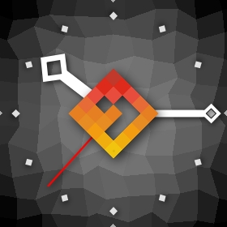 | [analog-asteroid-logo](analog-asteroid-logo/usr/share/asteroid-launcher/watchfaces/analog-asteroid-logo.qml) | [eLtMosen](https://github.com/eLtMosen) |
|  | | [analog-aviator](analog-aviator/usr/share/asteroid-launcher/watchfaces/analog-aviator.qml) | [eLtMosen](https://github.com/eLtMosen) |
|  |  | [analog-classy-roman](analog-classy-roman/usr/share/asteroid-launcher/watchfaces/analog-classy-roman.qml) | [eLtMosen](https://github.com/eLtMosen) |
|  |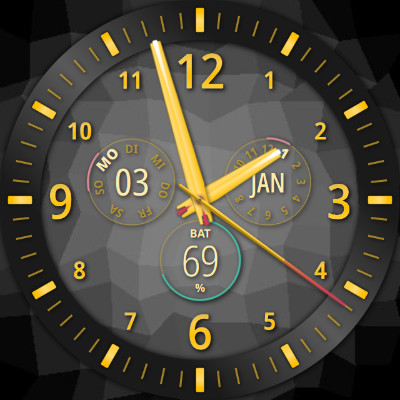 | [analog-goldie](analog-goldie/usr/share/asteroid-launcher/watchfaces/analog-goldie.qml) | [eLtMosen](https://github.com/eLtMosen) |
|  | | [analog-duppy-vintage](analog-duppy-vintage/usr/share/asteroid-launcher/watchfaces/analog-duppy-vintage.qml) | [eLtMosen](https://github.com/eLtMosen) |
|  |  | [analog-halloween](analog-halloween/usr/share/asteroid-launcher/watchfaces/analog-halloween.qml) | [beroset](https://github.com/beroset) |
|  |  | [analog-modern-steel](analog-modern-steel/usr/share/asteroid-launcher/watchfaces/analog-modern-steel.qml) | [CosmosDev](https://github.com/CosmosDev) |
|  |  | [analog-moega-sushimaster](analog-moega-sushimaster/usr/share/asteroid-launcher/watchfaces/analog-moega-sushimaster.qml) | [eLtMosen](https://github.com/eLtMosen) |
| 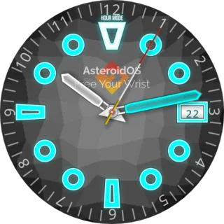 |  | [analog-neon-diver](analog-neon-diver/usr/share/asteroid-launcher/watchfaces/analog-neon-diver.qml) | [eLtMosen](https://github.com/eLtMosen) |
|  |  | [analog-nort](analog-nort/usr/share/asteroid-launcher/watchfaces/analog-nort.qml) | [eLtMosen](https://github.com/eLtMosen) |
|  | | [analog-precision](analog-precision/usr/share/asteroid-launcher/watchfaces/analog-precision.qml) | [Mario Kicherer](mailto:dev@kicherer.org) |
|  | | [analog-railway](analog-railway/usr/share/asteroid-launcher/watchfaces/analog-railway.qml) | [eLtMosen](https://github.com/eLtMosen) |
|  | 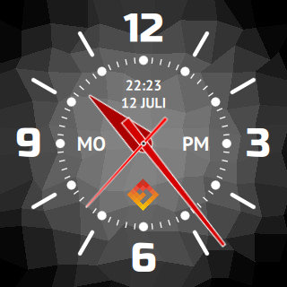 | [analog-red-handed](analog-red-handed/usr/share/asteroid-launcher/watchfaces/analog-red-handed.qml) | [eLtMosen](https://github.com/eLtMosen) |
|  |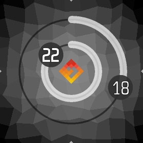 | [analog-rings](analog-rings/usr/share/asteroid-launcher/watchfaces/analog-rings.qml) | [eLtMosen](https://github.com/eLtMosen) |
|  |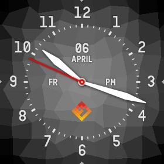 | [analog-scientific](analog-scientific/usr/share/asteroid-launcher/watchfaces/analog-scientific.qml) | [eLtMosen](https://github.com/eLtMosen) |
|  | | [analog-scientific-v2](analog-scientific-v2/usr/share/asteroid-launcher/watchfaces/analog-scientific-v2.qml) | [eLtMosen](https://github.com/eLtMosen) |
|  | 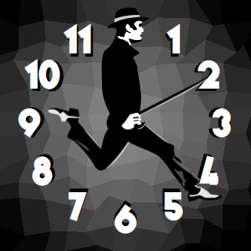 | [analog-silly-walks](analog-silly-walks/usr/share/asteroid-launcher/watchfaces/analog-silly-walks.qml) | [eLtMosen](https://github.com/eLtMosen) |
|  | | [analog-tactical](analog-tactical/usr/share/asteroid-launcher/watchfaces/analog-tactical.qml) | [eLtMosen](https://github.com/eLtMosen) |
|  |  | [analog-words](analog-words/usr/share/asteroid-launcher/watchfaces/analog-words.qml) | [eLtMosen](https://github.com/eLtMosen) |
|  |  | [analog-words-80s](analog-words-80s/usr/share/asteroid-launcher/watchfaces/analog-words-80s.qml) | [eLtMosen](https://github.com/eLtMosen) |
|  | | [arc (multiple)](arc/usr/share/asteroid-launcher/watchfaces/) | [jgibbon](https://github.com/jgibbon) |
|  | | [binary-digital](binary-digital/usr/share/asteroid-launcher/watchfaces/binary-digital.qml) | [eLtMosen](https://github.com/eLtMosen) |
|  | | [binary-lcd](binary-lcd/usr/share/asteroid-launcher/watchfaces/binary-lcd.qml) | [eLtMosen](https://github.com/eLtMosen) |
| 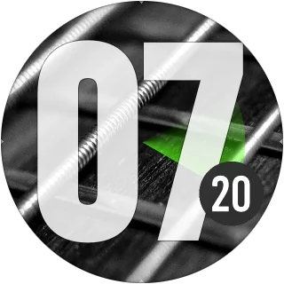 |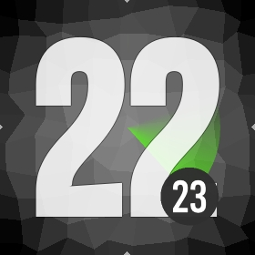 | [bold-hour-bebas-v2](bold-hour-bebas-v2/usr/share/asteroid-launcher/watchfaces/bold-hour-bebas-v2.qml) | [eLtMosen](https://github.com/eLtMosen) |
|  |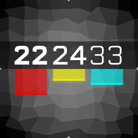 | [clean-bars](clean-bars/usr/share/asteroid-launcher/watchfaces/clean-bars.qml) | [eLtMosen](https://github.com/eLtMosen) |
|  | | [day-clock-24h](day-clock-24h/usr/share/asteroid-launcher/watchfaces/day-clock-24h.qml) | [eLtMosen](https://github.com/eLtMosen) |
|  | 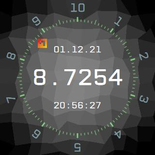 | [decimal-time](decimal-time/usr/share/asteroid-launcher/watchfaces/decimal-time.qml) | [beroset](https://github.com/beroset) |
|  | | [digital-alternative-default-mosen](digital-alternative-default-mosen/usr/share/asteroid-launcher/watchfaces/digital-alternative-default-mosen.qml) | [eLtMosen](https://github.com/eLtMosen) |
|  | | [digital-alternative-mosen](digital-alternative-mosen/usr/share/asteroid-launcher/watchfaces/digital-alternative-mosen.qml) | [eLtMosen](https://github.com/eLtMosen) |
| 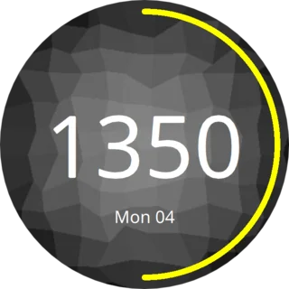 | 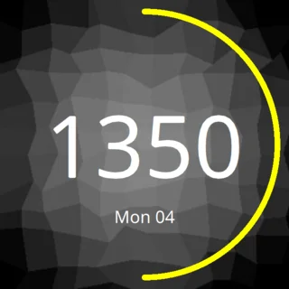 | [digital-charge-state](digital-charge-state/usr/share/asteroid-launcher/watchfaces/digital-charge-state.qml) | [beroset](https://github.com/beroset) |
|  | | [digital-fat-bwoy-slim](digital-fat-bwoy-slim/usr/share/asteroid-launcher/watchfaces/digital-fat-bwoy-slim.qml) | [eLtMosen](https://github.com/eLtMosen) |
| 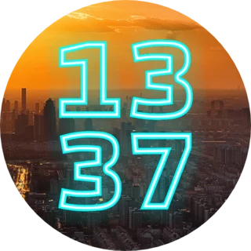 | | [digital-numeral-unity](digital-numeral-unity/usr/share/asteroid-launcher/watchfaces/digital-numeral-unity.qml) | [eLtMosen](https://github.com/eLtMosen) |
|  | | [digital-outfit](digital-outfit/usr/share/asteroid-launcher/watchfaces/) | [eLtMosen](https://github.com/eLtMosen) |
|  | | [digital-random-color-pop](digital-random-color-pop/usr/share/asteroid-launcher/watchfaces/digital-random-color-pop.qml) | [eLtMosen](https://github.com/eLtMosen) |
|  | | [digital-shifted](digital-shifted/usr/share/asteroid-launcher/watchfaces/digital-shifted.qml) | [eLtMosen](https://github.com/eLtMosen) |
|  | | [greenium](greenium/usr/share/asteroid-launcher/watchfaces/greenium.qml) | [eLtMosen](https://github.com/eLtMosen) |
|  | | [humongous](humongous/usr/share/asteroid-launcher/watchfaces/humongous.qml) | [eLtMosen](https://github.com/eLtMosen) |
|  | | [karlos-matrix](karlos-matrix/usr/share/asteroid-launcher/watchfaces/karlos-matrix.qml) | [eLtMosen](https://github.com/eLtMosen) |
|  | | [kitt](kitt/usr/share/asteroid-launcher/watchfaces/kitt.qml) | [jgibbon](https://github.com/jgibbon) |
|  | | [logo-45degree](logo-45degree/usr/share/asteroid-launcher/watchfaces/logo-45degree.qml) | [eLtMosen](https://github.com/eLtMosen) |
|  | | [motivational-quotes](motivational-quotes/usr/share/asteroid-launcher/watchfaces/motivational-quotes.qml) | [eLtMosen](https://github.com/eLtMosen) |
|  |  | [nixie-delight](nixie-delight/usr/share/asteroid-launcher/watchfaces/nixie-delight.qml) | [beroset](https://github.com/beroset) |
|  | | [numerals-duo-neon-green](numerals-duo-neon-green/usr/share/asteroid-launcher/watchfaces/numerals-duo-neon-green.qml) | [MagneFire](https://github.com/MagneFire) |
|  | | [numerals-duo-synth-neon-green](numerals-duo-synth-neon-green/usr/share/asteroid-launcher/watchfaces/numerals-duo-synth-neon-green.qml) | [eLtMosen](https://github.com/eLtMosen) |
|  | | [orbiting-asteroids](orbiting-asteroids/usr/share/asteroid-launcher/watchfaces/orbiting-asteroids.qml) | [eLtMosen](https://github.com/eLtMosen) |
| 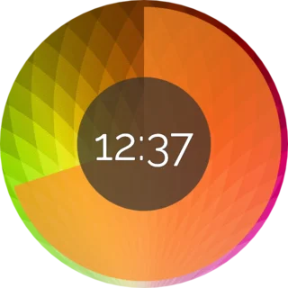 | | [prominent-seconds](prominent-seconds/usr/share/asteroid-launcher/watchfaces/prominent-seconds.qml) | [eLtMosen](https://github.com/eLtMosen) |
|  | 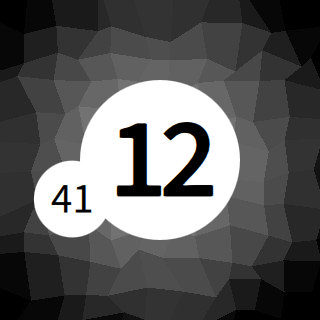 | [pulsedot](pulsedot/usr/share/asteroid-launcher/watchfaces/pulsedot.qml) | [eLtMosen](https://github.com/eLtMosen) |
|  |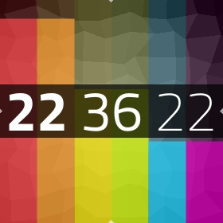 | [rainbow-uprising](rainbow-uprising/usr/share/asteroid-launcher/watchfaces/rainbow-uprising.qml) | [eLtMosen](https://github.com/eLtMosen) |
|  | | [retro-lcd](retro-lcd/usr/share/asteroid-launcher/watchfaces/retro-lcd.qml) | [Huntereb](mailto:Huntereb@lewd.pics), [eLtMosen](https://github.com/eLtMosen) |
|  | | [sporty-round](sporty-round/usr/share/asteroid-launcher/watchfaces/sporty-round.qml) | [eLtMosen](https://github.com/eLtMosen) |
|  | | [sporty-round-v2](sporty-round-v2/usr/share/asteroid-launcher/watchfaces/sporty-round-v2.qml) | [eLtMosen](https://github.com/eLtMosen) |

### Licenses ###

| Watchface - File | License |
| --- | --- |
| analog-duppy-vintage - [Kumar One](analog-duppy-vintage/usr/share/fonts/KumarOne-Regular.otf) [Kumar One Outline](analog-duppy-vintage/usr/share/fonts/KumarOneOutline-Regular.otf) | The font "Kumar One" is licensed under SIL Open Font License and was created by [Indian Type Foundry](https://fonts.google.com/?query=Indian+Type+Foundry). [license](http://scripts.sil.org/cms/scripts/page.php?site_id=nrsi&id=OFL)|
| analog-duppy-vintage - [Varieté - Regular](analog-duppy-vintage/usr/share/fonts/Varieté_Regular.ttf) | The font "Varieté" is licensed under SIL Open Font License and was created by [Peter Wiegel](https://de.fonts2u.com/variete.schriftart). [license](http://scripts.sil.org/cms/scripts/page.php?site_id=nrsi&id=OFL)|
| digital-outfit - [Outfit](digital-outfit/usr/share/fonts/Outfit-Regular.ttf) | The font "Outfit" is licensed under licensed under SIL Open Font License and was created by [Rodrigo Fuenzalida](https://fonts.google.com/?query=Rodrigo+Fuenzalida). [license](http://scripts.sil.org/cms/scripts/page.php?site_id=nrsi&id=OFL) |
| digital-fat-bwoy-slim - [Outfit](digital-fat-bwoy-slim/usr/share/fonts/Outfit-ExtraLight.ttf) | The font "Outfit" is licensed under licensed under SIL Open Font License and was created by [Rodrigo Fuenzalida](https://fonts.google.com/?query=Rodrigo+Fuenzalida). [license](http://scripts.sil.org/cms/scripts/page.php?site_id=nrsi&id=OFL) |
| digital-fat-bwoy-slim - [NASDAQER](digital-fat-bwoy-slim/usr/share/fonts/NASDAQER_Fett.ttf) | The font "NASDAQER" is licensed under licensed under CC BY 3.0 License and was created by Gustavo Paz L. [license](https://creativecommons.org/licenses/by/3.0/) |
| analog-scientific-v2 - [Outfit](analog-scientific-v2/usr/share/fonts/Outfit-Regular.ttf) | The font "Outfit" is licensed under licensed under SIL Open Font License and was created by [Rodrigo Fuenzalida](https://fonts.google.com/?query=Rodrigo+Fuenzalida). [license](http://scripts.sil.org/cms/scripts/page.php?site_id=nrsi&id=OFL) |
| analog-scientific-v2 - [Open Sans Condensed](analog-scientific-v2/usr/share/fonts/OpenSansCondensed-Light.ttf) | The font "Open Sans Condensed" is licensed under Apache License version 2.0 and was created by [Steve Matteson](https://fonts.google.com/?query=Steve%20Matteson). [license](http://www.apache.org/licenses/LICENSE-2.0) |
| numerals-duo-synth-neon-green - [Sunflower - Light](numerals-duo-synth-neon-green/usr/share/fonts/Sunflower_Light.ttf) | The font "Sunflower" is licensed under SIL Open Font License and was created by The Sunflower Project Authors. [license](http://scripts.sil.org/cms/scripts/page.php?site_id=nrsi&id=OFL) |
| analog-aviator - [Arkhip](analog-aviator/usr/share/fonts/Arkhip_font.ttf) | The font "Arkhip" is free for personal and comercial use and was created by Ivan Klimov, Irina Dementieva, Alexei Tikhonov Dominic [Klimov Design](https://www.behance.net/gallery/24073667/Arkhip-Typeface-Free). |
| analog-neon-diver - [Bebas Neue](analog-neon-diver/usr/share/fonts/BebasNeueBold.ttf) | The font "Bebas Neue" is licensed under SIL Open Font License and was created by [Dharma Type](http://www.dharmatype.com/). [license](http://scripts.sil.org/cms/scripts/page.php?site_id=nrsi&id=OFL) |
| analog-classy-roman - [Raleway - Regular](analog-classy-roman/usr/share/fonts/Raleway-Regular.ttf) | The font "Raleway" is licensed under SIL Open Font License and was created by [Matt McInerney](https://fonts.google.com/?query=Matt%20McInerney) & [Pablo Impallari](https://fonts.google.com/?query=Pablo%20Impallari). [license](http://scripts.sil.org/cms/scripts/page.php?site_id=nrsi&id=OFL)|
| analog-classy-roman - [Roboto Condensed - Bold](analog-classy-roman/usr/share/fonts/RobotoCondensed-Bold.ttf) | The font "Roboto Condensed" is licensed under Apache License, Version 2.0 and was created by [Christian Robertson](https://fonts.google.com/?query=Christian+Robertson). [license](https://www.apache.org/licenses/LICENSE-2.0.html)|
| analog-modern-steel - [Michroma - Regular](analog-modern-steel/usr/share/fonts/Michroma.ttf) | The font "Michroma" is licensed under SIL Open Font License and was created by [Vernon Adams](https://github.com/vernnobile). [license](http://scripts.sil.org/cms/scripts/page.php?site_id=nrsi&id=OFL)|
| analog-words, nixie-delight - [Montserrat - Regular](analog-words/usr/share/fonts/Montserrat-Regular.ttf) | The font "Montserrat" is licensed under SIL Open Font License and was created by [The Montserrat project](https://github.com/JulietaUla/Montserrat). [license](http://scripts.sil.org/cms/scripts/page.php?site_id=nrsi&id=OFL)|
| analog-words - [Source Sans Pro - Semibold](analog-words/usr/share/fonts/SourceSansPro-Semibold.ttf) [Source Sans Pro - Light](analog-words/usr/share/fonts/SourceSansPro-Light.ttf)| The font "Source Sans Pro" is licensed under SIL Open Font License and was created by [Paul D Hunt](https://fonts.google.com/specimen/Source+Sans+Pro). [license](http://scripts.sil.org/cms/scripts/page.php?site_id=nrsi&id=OFL)|
| analog-silly-walks - [Varieté - Regular](analog-silly-walks/usr/share/fonts/Varieté_Regular.ttf) | The font "Varieté" is licensed under SIL Open Font License and was created by [Peter Wiegel](https://de.fonts2u.com/variete.schriftart). [license](http://scripts.sil.org/cms/scripts/page.php?site_id=nrsi&id=OFL)|
| analog-red-handed - [PTSans - Bold](analog-red-handed/usr/share/fonts/PTSans-Bold.ttf) | The font "PTSans" is licensed under SIL Open Font License and was created by [Alexandra Korolkova, Olga Umpeleva and Vladimir Yefimov and released by ParaType](https://fonts.google.com/specimen/PT+Sans). [license](http://scripts.sil.org/cms/scripts/page.php?site_id=nrsi&id=OFL)|
| analog-red-handed - [Russo One - Regular](analog-red-handed/usr/share/fonts/RussoOne-Regular.ttf) | The font "Russo One" is licensed under SIL Open Font License and was created by [Jovanny Lemonad](https://fonts.google.com/specimen/Russo+One). [license](http://scripts.sil.org/cms/scripts/page.php?site_id=nrsi&id=OFL)|
| pulsedot - [Source Sans Pro - Semibold](pulsedot/usr/share/fonts/SourceSansPro-Semibold.ttf) [Source Sans Pro - Regular](pulsedot/usr/share/fonts/SourceSansPro-Regular.ttf)| The font "Source Sans Pro" is licensed under SIL Open Font License and was created by [Paul D Hunt](https://fonts.google.com/specimen/Source+Sans+Pro). [license](http://scripts.sil.org/cms/scripts/page.php?site_id=nrsi&id=OFL)|
| retro-lcd - [Digital-7 (Mono)](retro-lcd/usr/share/fonts/digital-7%20(mono).ttf) | The font "Digital-7" is freeware for home use and was created by [Sizenko Alexander](http://www.styleseven.com). |
| binary-lcd - [Digital-7 (Mono)](binary-lcd/usr/share/fonts/digital-7%20(mono).ttf) | The font "Digital-7" is freeware for home use and was created by [Sizenko Alexander](http://www.styleseven.com). |
| analog-rings [SlimSans](analog-rings/usr/share/fonts/SlimSans.ttf) | The font "SlimSans" was created by [Manfred Klein](https://web.archive.org/web/20170823125251/http://manfred-klein.ina-mar.com). Manfred’s fonts are free for private and charity use. They are even free for commercial use – but if there’s any profit, pls make a donation to organizations like [Doctors Without Borders](http://www.doctorswithoutborders.org/)|
| bold-hour-bebas-v2 - [BebasKai-Regular](bold-hour-bebas-v2/usr/share/fonts/BebasKai-Regular.otf), [Bebas Neue](bold-hour-bebas-v2/usr/share/fonts/BebasNeueBold.ttf) | The fonts "BebasKai" and "Bebas Neue" are licensed under SIL Open Font License and was created by [Dharma Type](http://www.dharmatype.com/). [license](bold-hour-bebas/usr/share/fonts/License.txt) |
| day-clock-24h - [Vollkorn-Regular](day-clock-24h/usr/share/fonts/Vollkorn-Regular.ttf) | The font "Vollkorn" is licensed under SIL Open Font License and was created by [Friedrich Althausen](http://www.vollkorn-typeface.com). [license](day-clock-24h/usr/share/fonts/OFL.txt)|
| digital-charge-state - [Titillium-Bold](digital-charge-state/usr/share/fonts/Titillium-Bold.otf), [Titillium-Light](digital-charge-state/usr/share/fonts/Titillium-Light.otf) | The font "Titillium" is licensed under SIL Open Font License and was created at the [Accademia di Belle Arti di Urbino](http://www.campivisivi.net/titillium/). [license](digital-charge-state/usr/share/fonts/OFL.txt)|
| greenium, digital-charge [Titillium-Bold](greenium/usr/share/fonts/Titillium-Bold.otf), [Titillium-Light](greenium/usr/share/fonts/Titillium-Light.otf) | The font "Titillium" is licensed under SIL Open Font License and was created at the [Accademia di Belle Arti di Urbino](http://www.campivisivi.net/titillium/). [license](greenium/usr/share/fonts/OFL.txt)|
| rainbow-uprising [Titillium-Bold](greenium/usr/share/fonts/Titillium-Bold.otf), [Titillium-Regular](rainbow-uprising/usr/share/fonts/Titillium-Regular.otf), [Titillium-Thin](rainbow-uprising/usr/share/fonts/Titillium-Thin.otf) | The font "Titillium" is licensed under SIL Open Font License and was created at the [Accademia di Belle Arti di Urbino](http://www.campivisivi.net/titillium/). [license](greenium/usr/share/fonts/OFL.txt)|
| sporty-round, sporty-round-v2 [SlimSans](sporty-round/usr/share/fonts/SlimSans.ttf) | The font "SlimSans" was created by [Manfred Klein](https://web.archive.org/web/20170823125251/http://manfred-klein.ina-mar.com). Manfred’s fonts are free for private and charity use. They are even free for commercial use – but if there’s any profit, pls make a donation to organizations like [Doctors Without Borders](http://www.doctorswithoutborders.org/)|
| numerals-duo-neon-green - [Assets](numerals-duo-neon-green/usr/share/asteroid-launcher/watchfaces-img/) | Assets are originally adapted from [mo_sandhu](https://amazfitwatchfaces.com/gts/view/4290) |
| numerals-duo-synth-neon-green - [Assets](numerals-duo-synth-neon-green/usr/share/asteroid-launcher/watchfaces-img/) | Assets are originally adapted from [mo_sandhu](https://amazfitwatchfaces.com/gts/view/4290) |
| orbiting-asteroids - [Blue Marble](orbiting-asteroids/usr/share/asteroid-launcher/wallpapers/nasa-blue-marble.jpg) | The image "Blue Marble", Eastern Hemisphere March 2014, Photo from NASA Goddard Space Flight Center is available under creative commons license |
| binary-digital - [Simpleness](binary-digital/usr/share/fonts/Simpleness.otf) | The font "Simpleness" is licensed under SIL Open Font License and was created by [Valentin Francois](http://valentinfrancois.fr/). [license](binary-digital/usr/share/fonts/License.pdf)|
| humongous - [Item-Black](humongous/usr/share/fonts/ITEMBL__.TTF) | The font "Item" is Public Domain and was created by [Bojmic Interpro](https://www.fontzillion.com/fonts/bojmic-interpro/item).|
| logo-45degree - [Sinner](logo-45degree/usr/share/fonts/SINNER__.TTF) | The font "Sinner" is freeware for personal, non-commercial use only and was created by [Helge Barske](http://www.barske.com/). [license-info](https://www.fontzillion.com/fonts/helge-barske/sinner)|
| motivational-quotes - [Lobster](motivational-quotes/usr/share/fonts/Lobster.otf) | The font "Lobster" is licensed under SIL Open Font License and was created by [Impallari Type](http://www.impallari.com/lobster). [license](http://scripts.sil.org/cms/scripts/page.php?site_id=nrsi&id=OFL)|
| nixie-delight - [Feronia](nixie-delight/usr/share/fonts/Feronia.ttf) | The font "Feronia" is licensed under GPL with font exception and SIL Open Font License and was created by [Peter Wiegel](http://www.peter-wiegel.de/Feronia.html). [license](http://scripts.sil.org/cms/scripts/page.php?site_id=nrsi&id=OFL)|
| clean-bars, decimal-time - [CPMono_v07](clean-bars/usr/share/fonts/) | The font "CPMono_v07" is licensed under CC-BY-3.0 and was created by [Tino Meinert, Liquitype](http://liquitype.fr/index.html). [license](clean-bars/usr/share/fonts/CC_License.txt)|
| analog-tactical - [Fyodor-BoldCondensed](analog-tactical/usr/share/fonts/Fyodor-BoldCondensed.ttf) | The font "Fyodor" is licensed under SIL Open Font License and was created by [Chris Hughes](http://fyodor.blueroomcollective.co.uk/). [license](http://scripts.sil.org/cms/scripts/page.php?site_id=nrsi&id=OFL)|
| analog-scientific - [Reglo](analog-scientific/usr/share/fonts/) | The font "Reglo" is licensed under SIL Open Font License and was created by [sebsan, Sebastien Sanfilippo](https://github.com/sebsan/Reglo). [license](https://github.com/sebsan/Reglo/blob/master/OFL.txt)|
| karlos-matrix - [Elektra SH](karlos-matrix/usr/share/fonts/) | According to fonts4free.net, the font "Elektra SH" is free for both personel and commercial usages and was created by [Samy Halim](https://www.fontshop.com/designers/samy-halim). [license](http://www.fonts4free.net/elektra-sh-font.html)|
| alternative-digital-mosen - [GeneraleMono](alternative-digital-mosen/usr/share/fonts/) | The font "GeneraleMono" is licensed under SIL Open Font License and was created by [ARIEL MARTÍN PÉREZ](http://www.arielgraphisme.com). [license](http://scripts.sil.org/cms/scripts/page.php?site_id=nrsi&id=OFL)|
