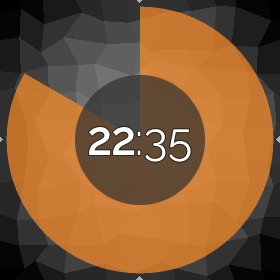

This repository tries to keep track of AsteroidOS unofficial watchfaces. Feel free
to pull request your work here and if it suits the graphic guidelines of
AsteroidOS it can eventually be merged in the default set of asteroid-launcher.

| Watchface | Title | Creator |
|---|---|---|
|  | [analog-precision](analog-precision/usr/share/asteroid-launcher/watchfaces/analog-precision.qml) | [Mario Kicherer](mailto:dev@kicherer.org) |
|  | [retro-lcd](retro-lcd/usr/share/asteroid-launcher/watchfaces/retro-lcd.qml) | [Huntereb](mailto:Huntereb@lewd.pics) |
|  | [kitt](kitt/usr/share/asteroid-launcher/watchfaces/kitt.qml) | [jgibbon](https://github.com/jgibbon) |
|  | [arc (multiple)](arc/usr/share/asteroid-launcher/watchfaces/) | [jgibbon](https://github.com/jgibbon) |
|  | [analog-rings](analog-rings/usr/share/asteroid-launcher/watchfaces/analog-rings.qml) | [eLtMosen](https://github.com/eLtMosen) |
|  | [binary-lcd](binary-lcd/usr/share/asteroid-launcher/watchfaces/binary-lcd.qml) | [eLtMosen](https://github.com/eLtMosen) |
|  | [bold-hour-bebas](bold-hour-bebas/usr/share/asteroid-launcher/watchfaces/bold-hour-bebas.qml) | [eLtMosen](https://github.com/eLtMosen) |
|  | [contemporary-digital-rings](contemporary-digital-rings/usr/share/asteroid-launcher/watchfaces/contemporary-digital-rings.qml) | [eLtMosen](https://github.com/eLtMosen) |
|  | [day-clock-24h](day-clock-24h/usr/share/asteroid-launcher/watchfaces/day-clock-24h.qml) | [eLtMosen](https://github.com/eLtMosen) |
|  | [greenium](greenium/usr/share/asteroid-launcher/watchfaces/greenium.qml) | [eLtMosen](https://github.com/eLtMosen) |
|  | [logo-45degree](logo-45degree/usr/share/asteroid-launcher/watchfaces/logo-45degree.qml) | [eLtMosen](https://github.com/eLtMosen) |
|  | [orbiting-asteroids](orbiting-asteroids/usr/share/asteroid-launcher/watchfaces/orbiting-asteroids.qml) | [eLtMosen](https://github.com/eLtMosen) |
|  | [prominent-seconds](prominent-seconds/usr/share/asteroid-launcher/watchfaces/prominent-seconds.qml) | [eLtMosen](https://github.com/eLtMosen) |
|  | [rainbow-uprising](rainbow-uprising/usr/share/asteroid-launcher/watchfaces/rainbow-uprising.qml) | [eLtMosen](https://github.com/eLtMosen) |
|  | [sporty-round](sporty-round/usr/share/asteroid-launcher/watchfaces/sporty-round.qml) | [eLtMosen](https://github.com/eLtMosen) |
|  | [worte](worte/usr/share/asteroid-launcher/watchfaces/worte.qml) | [eLtMosen](https://github.com/eLtMosen) |

### Installation ###
Enable ADB USB mode in settings and push the usr folder to your root directory.

`adb push usr /`

### Licenses ###

| File | License |
| --- | --- |
| retro-lcd - [Digital-7 (Mono)](retro-lcd/usr/share/fonts/digital-7%20(mono).ttf) | The font "Digital-7" is freeware for home use and was created by [Sizenko Alexander](http://www.styleseven.com). |
| binary-lcd - [Digital-7 (Mono)](binary-lcd/usr/share/fonts/digital-7%20(mono).ttf) | The font "Digital-7" is freeware for home use and was created by [Sizenko Alexander](http://www.styleseven.com). |
| bold-hour-bebas - [BebasKai-Regular](bold-hour-bebas/usr/share/fonts/BebasKai-Regular.otf) | The font "BebasKai" is licensed under Open Font License and was created by [Dharma Type](http://www.dharmatype.com/). [license](bold-hour-bebas/usr/share/fonts/License.txt) |
| contemporary-digital-rings - [Exo2-ExtraLight](contemporary-digital-rings/usr/share/fonts/Exo2-ExtraLight.otf), [Exo2-Regular](contemporary-digital-rings/usr/share/fonts/Exo2-Regular.otf) | The font [Exo2](https://fonts.google.com/specimen/Exo+2) is licensed under Open Font License and was created by [Natanael Gama](http://www.ndiscovered.com/). |
| day-clock-24h - [Vollkorn-Regular](day-clock-24h/usr/share/fonts/Vollkorn-Regular.ttf) | The font "Vollkorn" is licensed under Open Font License and was created by [Friedrich Althausen](http://www.vollkorn-typeface.com). [license](day-clock-24h/usr/share/fonts/OFL.txt)|
| greenium [Titillium-Bold](greenium/usr/share/fonts/Titillium-Bold.otf), [Titillium-Light](greenium/usr/share/fonts/Titillium-Light.otf) | The font "Titillium" is licensed under Open Font License and was created at the [Accademia di Belle Arti di Urbino](http://www.campivisivi.net/titillium/). [license](greenium/usr/share/fonts/OFL.txt)|
| rainbow-uprising [Titillium-Bold](greenium/usr/share/fonts/Titillium-Bold.otf), [Titillium-Regular](rainbow-uprising/usr/share/fonts/Titillium-Regular.otf), [Titillium-Thin](rainbow-uprising/usr/share/fonts/Titillium-Thin.otf) | The font "Titillium" is licensed under Open Font License and was created at the [Accademia di Belle Arti di Urbino](http://www.campivisivi.net/titillium/). [license](greenium/usr/share/fonts/OFL.txt)|
| sporty-round [SlimSans](sporty-round/usr/share/fonts/SlimSans.ttf) | The font "SlimSans" was created by [Manfred Klein](https://web.archive.org/web/20170823125251/http://manfred-klein.ina-mar.com). Manfred’s fonts are free for private and charity use. They are even free for commercial use – but if there’s any profit, pls make a donation to organizations like [Doctors Without Borders](http://www.doctorswithoutborders.org/)|
| orbiting-asteroids - [Blue Marble](orbiting-asteroids/usr/share/asteroid-launcher/wallpapers/nasa-blue-marble.jpg) | The image "Blue Marble", Eastern Hemisphere March 2014, Photo from NASA Goddard Space Flight Center is available under creative commons license |

