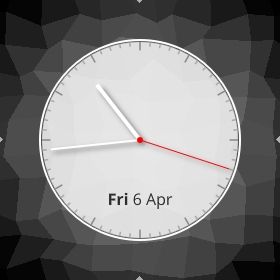

This repository tries to keep track of AsteroidOS unofficial watchfaces. Feel free
to pull request your work here and if it suits the graphic guidelines of
AsteroidOS it can eventually be merged in the default set of asteroid-launcher.

| Watchface | Title | Creator |
|---|---|---|
|  | [analog-precision](analog-precision/usr/share/asteroid-launcher/watchfaces/analog-precision.qml) | [Mario Kicherer](mailto:dev@kicherer.org) |
|  | [retro-lcd](retro-lcd/usr/share/asteroid-launcher/watchfaces/retro-lcd.qml) | [Huntereb](mailto:Huntereb@lewd.pics) |

### Installation ###
Enable ADB USB mode in settings and push the usr folder to your root directory.

`adb push usr /`

### Licenses ###

| File | License |
| --- | --- |
| retro-lcd - [Digital-7 (Mono)](retro-lcd/usr/share/fonts/digital-7%20(mono).ttf) | The font "Digital-7" is freeware for home use and was created by [Sizenko Alexander](http://www.styleseven.com). |
